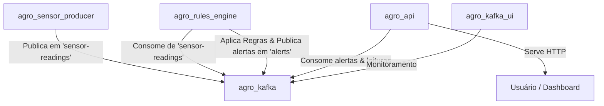

# Requisitos

### Visão Geral & Objetivos

O AgroSmart é uma solução inovadora de agricultura de precisão para monitoramento em tempo real de talhões agrícolas utilizando sensores IoT, streaming de dados distribuído e um motor de regras inteligente. O objetivo deste plano é estruturar a entrega acadêmica cobrindo três pilares fundamentais:
1. **Pipeline de Dados com Streaming (30%)**: Simulação em tempo real do fluxo de dados com thread-based queue e Apache Kafka real.
2. **Containerização da Solução (30%)**: Orquestração completa dos microsserviços via Docker Compose.
3. **Modelo de Negócio (40%)**: Definição do Canvas e do pitch de negócios.

### Escopo

*   **Em Escopo**:
    *   Execução e validação da simulação de pipeline local via `pipeline_simulado.py`.
    *   Configuração e orquestração multi-container via `docker-compose.yml`.
    *   Estruturação do Business Model Canvas completo e roteirização do pitch em vídeo de 2 a 4 minutos.
    *   Testes de ponta a ponta dos fluxos de dados e endpoints da API.
*   **Fora de Escopo**:
    *   Implementação de novos sensores físicos.
    *   Deploy em nuvem pública de produção (AWS/Azure/GCP) neste estágio.

### Histórias de Usuário

*   **Como** produtor rural, **quero** receber alertas críticos em tempo real sobre pragas e umidade **para** que eu possa tomar decisões corretivas antes de sofrer perdas de safra.
*   **Como** operador de TI da fazenda, **quero** subir toda a infraestrutura de monitoramento com um único comando Docker **para** simplificar a implantação e manutenção dos serviços.

### Requisitos Funcionais (RF)

*   **RF-01 (Simulação de Sensores)**: O sistema deve gerar continuamente leituras sintéticas de temperatura, umidade, pragas e folhas doentes.
*   **RF-02 (Processamento de Regras)**: Avaliar três regras booleanas em tempo real:
    *   *Infestação*: `perc_folhas_doentes > 30` E `praga_detectada != "nenhuma"`.
    *   *Irrigação*: `umidade_solo_pct < 30` E `nivel_irrigacao == "baixo"`.
    *   *Temperatura*: `temperatura_c > 35` OU `temperatura_c < 12`.
*   **RF-03 (Notificação de Alertas)**: Publicar alertas estruturados com severidades (Crítico, Atenção, Aviso), recomendações e ações automáticas.
*   **RF-04 (Dashboard & API)**: Exibir dados em tempo real em um painel web e disponibilizar endpoints HTTP (`/` e `/api/dados`).
*   **RF-05 (Visualização do Kafka)**: Disponibilizar interface gráfica (Kafka UI) para monitoramento dos tópicos de streaming.

# Design Técnico

### Arquitetura de Referência

O AgroSmart utiliza uma arquitetura de microsserviços orientada a eventos (EDA) usando Apache Kafka para garantir resiliência, baixa latência e escalabilidade.



### Componentes de Software

1.  **Zookeeper (`agro_zookeeper`)**: Coordena e gerencia o cluster Kafka.
2.  **Kafka Broker (`agro_kafka`)**: Barramento de mensageria de alta performance com dois tópicos principais:
    *   `sensor-readings` (3 partições, 24 horas de retenção).
    *   `alerts` (1 partição, 7 dias de retenção).
3.  **Kafka UI (`agro_kafka_ui`)**: Painel de visualização web exposto na porta `8080`.
4.  **Sensor Producer (`agro_sensor_producer`)**: Script Python autônomo que gera leituras sintéticas a cada 5 segundos e as publica no Kafka.
5.  **Rules Engine (`agro_rules_engine`)**: Consumidor Python que lê as mensagens de sensores, aplica lógica booleana e emite alertas estruturados no tópico de saída.
6.  **API & Dashboard (`agro_api`)**: Aplicação Flask na porta `5000` que recebe os alertas e os renderiza em um painel interativo em tempo real para o usuário final.

### Modelos de Dados

*   **Leitura do Sensor (`sensor-readings`)**:
    ```json
    {
      "timestamp": "2025-06-23T14:30:00",
      "talhao_id": "T-02",
      "perc_folhas_doentes": 45.3,
      "praga_detectada": "pulgao",
      "umidade_solo_pct": 22.1,
      "temperatura_c": 28.5,
      "nivel_irrigacao": "baixo"
    }
    ```
*   **Alerta Gerado (`alerts`)**:
    ```json
    {
      "regra": "INFESTAÇÃO",
      "nivel": "CRÍTICO",
      "icone": "🚨",
      "talhao_id": "T-02",
      "timestamp": "2025-06-23T14:30:00",
      "detalhe": "Folhas doentes: 45.3% | Praga: pulgao",
      "recomendacoes": [
        "Isolar o talhão afetado imediatamente",
        "Acionar equipe de controle fitossanitário"
      ],
      "acoes_automaticas": [
        "Notificação enviada ao agrônomo responsável"
      ]
    }
    ```

### Estrutura de Arquivos Existente

*   `pipeline/pipeline_simulado.py`: Script de execução independente para validação imediata em memória.
*   `pipeline/kafka-topics.yml`: Definição de tópicos e particionamento do Kafka.
*   `docker/docker-compose.yml`: Orquestração multi-container da infraestrutura.
*   `docker/producer/`: Dockerfile, código e dependências do gerador de eventos.
*   `docker/rules-engine/`: Dockerfile, código e dependências do motor de regras.
*   `docker/api/`: Dockerfile e dependências para a API Flask.
*   `canvas/business_model_canvas.md`: Detalhamento estratégico do modelo de negócio SaaS.

### Riscos e Mitigações

*   **Risco**: Indisponibilidade temporária do Broker Kafka na inicialização rápida dos containers dependentes.
    *   *Mitigação*: Implementação de lógica de reconexão robusta (`retries` e `delay`) em todos os scripts Python (`producer.py` e `consumer.py`), combinada com `healthcheck` apropriado no `docker-compose.yml`.

# Validação e Testes

### Abordagem de Validação

Os testes serão focados na consistência do fluxo de dados e no comportamento reativo do sistema sob condições normais e extremas.

### Cenários de Teste Chave

1.  **Teste do Fluxo Simulado**: Executar `pipeline_simulado.py` e verificar se as regras são acionadas conforme os thresholds estabelecidos.
2.  **Inicialização da Stack Docker**: Subir a stack completa e verificar se todos os 6 containers estão marcados como `healthy` / `running`.
3.  **Fluxo Kafka de Ponta a Ponta**:
    *   Validar que o `sensor-producer` publica dados no tópico `sensor-readings`.
    *   Validar que o `rules-engine` consome as mensagens, processa as regras booleanas e cria alertas no tópico `alerts`.
    *   Validar que as requisições na porta `5000` retornam os dados consolidados.

### Casos de Borda Testados

*   **Alta Carga de Mensagens**: Verificar se a janela deslizante de 50 mensagens do `rules-engine` se mantém estável sem vazamento de memória.
*   **Tópico Kafka Vazio**: Confirmar se o consumidor e a API lidam de forma graciosa quando nenhuma mensagem foi enviada ainda.

# Delivery Steps

### ✓ Step 1: executar-validacao-pipeline-simulado
O pipeline simulado em memória roda com sucesso exibindo as leituras de sensores e geração de alertas no console de forma síncrona.

- Validar e executar o arquivo `pipeline/pipeline_simulado.py` usando o terminal.
- Instalar e configurar a biblioteca de visualização `rich` no ambiente virtual local.
- Monitorar a saída do console para garantir a correta aplicação das 3 regras booleanas (Infestação, Irrigação, Temperatura) sobre as mensagens sintéticas dos talhões rurais.
- Obter registros e métricas de desempenho das threads para servir de artefato comprobatório.

### ✓ Step 2: orquestrar-e-validar-containers-docker
Toda a infraestrutura do AgroSmart está ativa e comunicando-se perfeitamente através de uma rede de containers Docker isolada.

- Analisar o arquivo `docker/docker-compose.yml` para assegurar a corretude das portas expostas (5000 para API, 8080 para Kafka UI, 9092 para Kafka).
- Realizar o build e inicialização dos 6 containers (`sensor-producer`, `rules-engine`, `api`, `kafka`, `zookeeper`, `kafka-ui`) usando `docker compose up --build -d`.
- Verificar a integridade e saúde de cada serviço através de comandos de status e logs em tempo real.
- Validar a criação automática dos tópicos Kafka `sensor-readings` e `alerts` acessando a interface gráfica do Kafka UI em `http://localhost:8080`.
- Testar a integridade da API Flask acessando localmente os endpoints `/` e `/api/dados` confirmando a recepção dos alertas do motor de regras.

### ✓ Step 3: refinar-documentacao-business-model-canvas
O Business Model Canvas está refinado e estruturado juntamente com o roteiro completo para a gravação do pitch em vídeo de 2 a 4 minutos.

- Revisar e formatar o arquivo `canvas/business_model_canvas.md` cobrindo todas as 9 áreas essenciais de negócios do AgroSmart.
- Elaborar um roteiro profissional detalhado dividido por minutos (0:00-4:00) estruturando a explicação da proposta de valor, fontes de receita recorrentes (SaaS), custos operacionais de sensores e canais de aquisição.
- Atualizar a documentação principal (`README.md`) com instruções de execução, arquitetura geral e informações do time para a entrega final da FIAP.