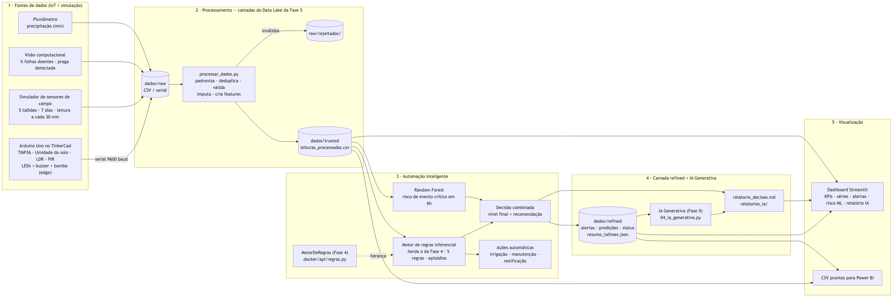

# AgroSmart — Entrega da Atividade Acadêmica (FIAP 4ESOA)

## Visão Geral

Este pacote complementa o repositório [`G3n4r00/agro_monitor`](https://github.com/G3n4r00/agro_monitor)
com os artefatos exigidos pela atividade, organizados em fases que evoluem o mesmo projeto:

- **Fase 4** — Pipeline de dados com streaming, containerização com Docker e Business Model Canvas (v1).
- **Fase 5** — Arquitetura de Data Lake, processo de ingestão/manutenção de dados, IA Generativa
  como apoio à decisão e evolução do modelo de negócio (Canvas v2).
- **Fase 6** — Plataforma inteligente integrada: coleta IoT (Arduino no TinkerCad + simulador),
  processamento de dados, automação com motor de regras + Machine Learning e dashboard analítico.

---

# Fase 4

## 1. Pipeline de Dados com Streaming (30%)

### Arquitetura do Pipeline

```
[Sensores IoT] → [Kafka Producer] → [Tópico: sensor-readings] → [Motor de Regras] → [Tópico: alerts] → [API Flask] → [Dashboard]
```

### Opção A — Simulação sem Kafka (execução imediata)

```bash
pip install rich
python pipeline/pipeline_simulado.py
```

O script `pipeline_simulado.py` simula o comportamento completo de um pipeline Kafka usando `queue.Queue` e threads Python, mostrando em tempo real:
- Leituras geradas pelo "producer" (sensores)
- Avaliação das 3 regras booleanas pelo "consumer" (motor de regras)
- Alertas publicados no "tópico" de saída

### Opção B — Kafka real via Docker

```bash
cd docker
docker compose up -d zookeeper kafka kafka-ui sensor-producer rules-engine
```

Acesse o Kafka UI em `http://localhost:8080` para visualizar os tópicos `sensor-readings` e `alerts` em tempo real.

> **Continuação na Fase 6:** o motor de regras da API (`docker/api/regras.py`) é a classe base do motor
> de regras da Fase 6 — ver [Fase 6](#fase-6).

### Configuração dos tópicos Kafka

Ver `pipeline/kafka-topics.yml` para especificação de partições, retenção e exemplos de mensagem.

---

## 2. Containerização com Docker (30%)

### Estrutura dos containers

| Container | Imagem | Porta | Função |
|---|---|---|---|
| `agro_zookeeper` | confluentinc/cp-zookeeper:7.6.0 | — | Coordenação do Kafka |
| `agro_kafka` | confluentinc/cp-kafka:7.6.0 | 9092 | Broker de mensagens |
| `agro_kafka_ui` | provectuslabs/kafka-ui | 8080 | Visualização dos tópicos |
| `agro_sensor_producer` | python:3.11-slim (build local) | — | Geração de dados dos sensores |
| `agro_rules_engine` | python:3.11-slim (build local) | — | Motor de regras e alertas |
| `agro_api` | python:3.11-slim (build local) | 5001 (host) -> 5000 (container) | API Flask + Dashboard (porta alterada de 5000 para 5001 para evitar conflito com AirPlay no macOS) |

### Como executar

```bash
# Clonar o repo original e copiar os arquivos Python para docker/api/
git clone https://github.com/SarahRSilva/agro-monitor
cp agro-monitor/main.py agro-monitor/gerador.py agro-monitor/regras.py docker/api/

# Subir toda a stack
cd docker
docker compose up --build -d

# Verificar status
docker compose ps

# Logs em tempo real
docker compose logs -f
```

### Endpoints disponíveis

- `http://localhost:5001` — Dashboard web do AgroSmart (mapeado de 5000 do container para evitar colisão de porta 5000 com AirPlay no macOS)
- `http://localhost:5001/api/dados` — API JSON com leituras e alertas
- `http://localhost:8080` — Kafka UI (tópicos em tempo real)

### Parar os containers

```bash
docker compose down
```

---

## 3. Modelo de Negócio com Canvas v1 (40%)

O Business Model Canvas original do AgroSmart está no arquivo `canvas/business_model_canvas.md`
e resumido abaixo. **Este canvas foi atualizado na Fase 5** — ver `business-model/business_model_canvas_v2.md`.

### Proposta de Valor

O AgroSmart entrega **monitoramento agrícola em tempo real** para produtores rurais via sensores IoT e um motor de regras inteligente que detecta infestações, deficiência hídrica e anomalias climáticas antes que causem perdas significativas. A solução roda em cloud, é acessada via browser (sem instalação) e gera alertas classificados por severidade com recomendações de ação.

### Modelo de Receita (SaaS + Hardware)

- **Assinatura mensal por talhão** (modelo SaaS escalável)
- **Venda de kits de sensores** homologados para a plataforma
- **Add-ons** de análise avançada e integração com ERPs agrícolas

### Segmentos

Pequenos e médios produtores → cooperativas → agroindústrias → centros de pesquisa.

---

# Fase 5

A Fase 5 evolui a arquitetura para um **Data Lake em camadas**, incorpora **IA Generativa** como
apoio à decisão e atualiza o **modelo de negócio** para incluir monetização baseada em dados. Ver
detalhes completos em cada artefato listado abaixo.

## 4. Arquitetura de Dados com Data Lake

Diagrama da arquitetura (fontes → ingestão → camadas Raw/Trusted/Refined → consumo) e explicação
textual de cada camada em [`data-lake/architecture.md`](data-lake/architecture.md).

> **Versão executável:** a pasta [`datalake-demo/`](datalake-demo/) implementa essa arquitetura de
> verdade em Python puro (sem dependências externas) — rode `python3 datalake-demo/run_pipeline.py`
> para ver a ingestão, validação, agregação e o relatório de IA rodando de ponta a ponta. Detalhes em
> [`datalake-demo/README.md`](datalake-demo/README.md).

### Como rodar o Data Lake Demo

**Importante:** os 4 scripts precisam estar dentro de `datalake-demo/scripts/`, e não soltos
direto em `datalake-demo/` — o `run_pipeline.py` procura especificamente em
`datalake-demo/scripts/01_ingestao.py`. A pasta `ingestion/samples/` também precisa existir um
nível acima de `datalake-demo/`, pois `01_ingestao.py` lê os exemplos de lá. A estrutura correta é:

```
agro_monitor_entrega/
├── ingestion/
│   └── samples/                ← os scripts leem daqui
└── datalake-demo/
    ├── run_pipeline.py
    └── scripts/                 ← os 4 .py precisam estar AQUI DENTRO
        ├── 01_ingestao.py
        ├── 02_camada_trusted.py
        ├── 03_camada_refined.py
        └── 04_ia_generativa.py
```

Com a estrutura correta, rode o pipeline completo:

```bash
cd datalake-demo
python3 run_pipeline.py
```

Isso executa, em sequência: ingestão (popula `datalake/raw/`, incluindo uma leitura inválida de
propósito para testar a rejeição) → validação/limpeza (`datalake/trusted/`) → agregação por
talhão (`datalake/refined/resumo_talhoes.json`) → geração do relatório de IA por talhão
(`datalake/refined/relatorios_ia/`).

Também é possível rodar cada etapa isoladamente ou plugar uma IA real (Anthropic) no lugar do
motor de regras simulado — ver instruções completas em
[`datalake-demo/README.md`](datalake-demo/README.md).

## 5. Processo de Ingestão, Administração e Manutenção de Dados

Diagrama de sequência do fluxo de ingestão, exemplos de dados ingeridos e a estratégia de
validação/retenção/backup em [`ingestion/ingestion_flow.md`](ingestion/ingestion_flow.md), com
exemplos em `ingestion/samples/`:
- `leitura_sensor.json` — leitura pontual de sensor IoT
- `leituras_solo.csv` — lote diário de leituras de solo
- `deteccao_imagem.json` — metadados de detecção de praga via visão computacional

## 6. Inteligência Artificial Generativa para Apoio à Decisão

Descrição do funcionamento, contexto utilizado (dados da camada Refinada) e exemplo completo de
relatório gerado em [`ia-generativa/decision_support.md`](ia-generativa/decision_support.md).

> **Continuação na Fase 6:** o mesmo módulo (`datalake-demo/scripts/04_ia_generativa.py`) gera os
> relatórios dos talhões da Fase 6, com o contexto enriquecido pelos alertas das regras e pelo risco
> previsto pelo ML — ver seção 9.5.

## 7. Modelo de Negócio e Inteligência de Dados (Canvas v2)

Canvas atualizado com monetização baseada em dados (score de risco para seguradoras, relatórios
agregados, API paga de insights) e roteiro do vídeo de 2–3 minutos em
[`business-model/business_model_canvas_v2.md`](business-model/business_model_canvas_v2.md).

---

# Fase 6

A Fase 6 é a **continuação direta** das Fases 4 e 5: em vez de componentes soltos, o AgroSmart vira
uma plataforma única e funcional que **coleta** dados do ambiente (Arduino no TinkerCad + simulador de
sensores — no papel do producer da Fase 4), **processa** e organiza esses dados nas camadas do
Data Lake da Fase 5, **executa análises automatizadas** (o motor de regras da Fase 4 estendido +
Machine Learning + a IA Generativa da Fase 5) e **apresenta insights** em um dashboard analítico.

```
 Arduino/TinkerCad ─┐                                                    regras (Fase 4) + ML
 Simulador campo  ──┼─► dados/raw ─► processamento ─► dados/trusted ─► automação ─► dados/refined ─► Dashboard
 Câmera/pluviômetro ┘   (+ rejeitados)  (limpa, valida,                  (alertas, ações,   │
                                         features)                       risco 6h, decisão)  └─► IA Generativa (Fase 5)
```

### O que a Fase 6 reaproveita das fases anteriores

| De onde | O quê | Como |
|---|---|---|
| Fase 4 — `docker/api/regras.py` | Classe `MotorDeRegras`, condições e limiares das 3 regras | O motor da Fase 6 (`MotorDeRegrasInferencial`) **herda** essa classe e usa `mascara_infestacao`, `mascara_irrigacao`, `mascara_temperatura` e as constantes `LIMIAR_*` como base das regras graduadas. É o mesmo arquivo usado pela API Flask, então se um limiar mudar ali, muda nas duas fases. |
| Fase 5 — `datalake-demo/` | Camadas do Data Lake | `dados/raw` (com `raw/rejeitados/`) → `dados/trusted` → `dados/refined`, a mesma organização e a mesma regra de rejeição auditável. |
| Fase 5 — `03_camada_refined.py` | Contrato de dados `resumo_talhoes.json` e `calcular_tendencia` | `automacao/apoio_decisao_ia.py` publica o resumo por talhão no mesmo formato, acrescentando `alertas_automacao` e `risco_previsto_6h`. |
| Fase 5 — `04_ia_generativa.py` | Gerador de relatórios de apoio à decisão | Gera um relatório por talhão da Fase 6 em `dados/refined/relatorios_ia/`, que também aparece no dashboard. Funciona em modo simulado ou com a API da Anthropic (`python run_plataforma.py --real`). |

```bash
python3 -m venv .venv && source .venv/bin/activate
pip install -r requirements.txt
python run_plataforma.py --dashboard     # pipeline completo + dashboard em http://localhost:8501
```

## 8. Requisitos x artefatos entregues (Fase 6)

| Requisito (peso) | Artefatos | Onde |
|---|---|---|
| **1. Arquitetura da solução (20%)** | Diagrama da arquitetura; descrição de cada componente; integração com as fases 4 e 5 | `arquitetura/arquitetura.md`, `docs/arquitetura.png` |
| **2. Coleta de dados — IoT/simulação (20%)** | Circuito e código do TinkerCad; descrição dos sensores; exemplo de dados gerados; simulador em escala | `iot/agrosmart_tinkercad.ino`, `iot/circuito.md`, `dados/raw/`, `iot/simulador_sensores.py`, print do TinkerCad em `docs/prints/` |
| **3. Processamento e preparação** | Script de processamento; dataset processado; explicação do fluxo | `processamento/processar_dados.py`, `dados/trusted/`, seção 9.3 abaixo |
| **4. Automação inteligente (20%)** | Código (regras + ML); descrição da decisão automatizada; exemplos de saída | `automacao/automacao_inteligente.py`, `automacao/apoio_decisao_ia.py`, `dados/refined/`, seções 9.4 e 9.5 abaixo |
| **5. Dashboard analítico (20%)** | Dashboard funcional; capturas; descrição dos indicadores | `dashboard/app.py`, `docs/prints/`, seção 9.6 abaixo |
| **6. Demonstração (20%)** | Vídeo de 3 a 5 min | roteiro na seção 11; link em `docs/link_video.txt` |

---

## 9. O que foi feito

### 9.1 Arquitetura

Arquitetura em 5 blocos — **Fontes → Processamento → Automação → Refined + IA Generativa →
Visualização** — detalhada em [`arquitetura/arquitetura.md`](arquitetura/arquitetura.md). Reaproveita o
motor de regras da Fase 4 e as camadas do Data Lake e a IA Generativa da Fase 5 (ver a tabela acima).



### 9.2 Coleta de dados (IoT + simulação)

**Duas fontes, mesmo formato:**

- **Arduino Uno no TinkerCad** (`iot/agrosmart_tinkercad.ino`) com **TMP36** (temperatura),
  **sensor de umidade do solo**, **fotorresistor** (luminosidade) e **PIR** (evento de movimento).
  Além de coletar, o Arduino já faz **automação de borda**: liga a "bomba de irrigação" (LED azul)
  com histerese 30% → 45%, mostra o status no semáforo de LEDs e dispara o buzzer em situação
  crítica. A cada 2 s envia uma linha CSV pela serial. Montagem e sensores em
  [`iot/circuito.md`](iot/circuito.md).
- **Simulador de campo** (`iot/simulador_sensores.py`): como o TinkerCad gera poucos segundos de
  dados e um único ponto, o simulador produz o mesmo tipo de leitura **em escala** — 5 talhões ×
  7 dias × 1 leitura a cada 30 min = 1.680 leituras — acrescentando câmera (folhas doentes / praga)
  e pluviômetro. Cada talhão tem um cenário:

  | Talhão | Cenário | O que a automação deve detectar |
  |---|---|---|
  | TAL-01 | Normal, irrigação funcionando | Quase nada (controle) |
  | TAL-02 | Seca com irrigação quebrada | Déficit hídrico + falha de irrigação |
  | TAL-03 | Onda de calor a partir do 4º dia | Temperatura extrema |
  | TAL-04 | Infestação de lagarta a partir do 3º dia | Infestação + movimento noturno |
  | TAL-05 | Noites frias | Risco de geada |

  O simulador também **injeta problemas reais de qualidade**: 6 retransmissões duplicadas, 10
  campos vazios, 5 valores impossíveis (ex.: umidade 137,4%, temperatura −99 °C) e mensagens fora de
  ordem. A semente fixa (`--seed 42`) torna o resultado reproduzível.

**Exemplo de dado gerado** (`dados/raw/sensores_campo.csv`):

```
timestamp,talhao_id,sensor_id,temperatura_c,umidade_solo_pct,luminosidade_pct,movimento_detectado,irrigacao_ligada,precipitacao_mm,perc_folhas_doentes,praga_detectada
2026-10-02 14:30:00,TAL-04,SNS-04,30.7,31.8,83.4,0,0,0.0,52.4,lagarta
```

### 9.3 Processamento e preparação dos dados

`processamento/processar_dados.py` (Python + pandas). Fluxo de dados:

1. **Leitura** de `sensores_campo.csv` e `tinkercad_serial.txt`. O `millis` do Arduino é convertido
   para data/hora e a estação vira o talhão `TAL-TC`.
2. **Padronização** em um schema único (tipos numéricos, timestamp, texto em minúsculas).
3. **Deduplicação** por `(talhao_id, timestamp)` → remove as 6 retransmissões.
4. **Validação de faixas físicas** (temperatura −10 a 55 °C; umidade, luz e folhas 0 a 100%). As
   leituras inválidas **não são descartadas em silêncio**: vão para `dados/raw/rejeitados/rejeitados.csv`
   com o motivo, como na Fase 5.
5. **Imputação** dos campos vazios por interpolação temporal dentro do próprio talhão
   (marcados com `valor_imputado = 1`).
6. **Criação de features**: `umidade_media_3h`, `temp_media_3h`, `tendencia_umidade_6h`,
   `chuva_24h_mm`, `temp_max_24h`, `temp_min_24h`, `hora`, `periodo_dia`, `praga_presente`.
7. **Gravação nas camadas:** leituras limpas em `dados/trusted/leituras_processadas.csv`, relatório de
   qualidade em `dados/trusted/qualidade_dados.json` e agregação diária por talhão em
   `dados/refined/resumo_diario.csv`.

Resultado com a semente padrão: 1.706 linhas recebidas → 6 duplicadas removidas → 5 rejeitadas →
10 imputadas → **1.695 linhas processadas** com 23 colunas.

### 9.4 Automação inteligente

`automacao/automacao_inteligente.py` combina **duas abordagens complementares**:

**A) Motor de regras inferencial** — a classe `MotorDeRegrasInferencial` **herda o `MotorDeRegras` da
Fase 4** (`docker/api/regras.py`). As 3 regras booleanas de lá viram a condição base das regras graduadas
daqui: IRRIGAÇÃO → FALHA_IRRIGACAO, TEMPERATURA → TEMPERATURA_EXTREMA e INFESTAÇÃO → INFESTACAO
(crítico). DEFICIT_HIDRICO e MOVIMENTO_NOTURNO são novas.

| Regra | Condição | Nível | Ação automática |
|---|---|---|---|
| FALHA_IRRIGACAO | umidade < 30% **e** irrigação desligada **e** chuva 24h < 2 mm | CRÍTICO | Abre ordem de manutenção, notifica o gestor |
| DEFICIT_HIDRICO | umidade < 20% / < 30% sem chuva / caindo > 6 p.p. em 6h abaixo de 40% | CRÍTICO / ATENÇÃO / AVISO | Envia comando `IRRIGACAO_ON` |
| TEMPERATURA_EXTREMA | > 38 °C ou < 3 °C / > 35 °C / < 12 °C | CRÍTICO / ATENÇÃO / AVISO | Aumenta frequência de leitura, alerta o gestor |
| INFESTACAO | praga detectada **e** folhas doentes > 30% / > 15% | CRÍTICO / ATENÇÃO | Marca talhão em monitoramento intensivo, aciona equipe |
| MOVIMENTO_NOTURNO | PIR = 1 **e** luminosidade < 10% | AVISO | Grava evento e aciona câmera |

Leituras consecutivas que disparam a mesma regra viram **um episódio** (com início, fim, duração e
pior valor), em vez de um alerta a cada 30 min. A recomendação se adapta ao caso (ex.: calor →
"irrigar no fim da tarde"; frio → "irrigação noturna de proteção").

**B) Machine Learning preditivo** — `RandomForestClassifier`:

- **Pergunta:** "vai acontecer um evento crítico neste talhão nas **próximas 6 horas**?"
  (umidade < 20%, temperatura > 38 °C ou < 3 °C, ou infestação com > 30% de folhas doentes).
- **Entradas:** as 14 features do processamento (umidade, tendência, médias móveis, chuva acumulada,
  extremos de temperatura, folhas doentes, hora...).
- **Validação temporal:** treina nos 5 primeiros dias e testa nos 2 últimos (sem "espiar o futuro").
- **Resultado no teste:** acurácia **93,8%**, precisão **97,6%**, recall **92,4%**, F1 **0,949**.
- **Comparação com o baseline** (regra reativa: "só avisa quando o evento já está acontecendo"):
  F1 0,887 e recall 80,9%. O modelo **antecipa 11,5 p.p. a mais dos eventos críticos**.
- A probabilidade vira risco **BAIXO** (< 30%), **MÉDIO** (30–60%) ou **ALTO** (≥ 60%).

**Decisão combinada:** para cada talhão, o nível final é o mais grave entre o alerta ativo (regras) e o
risco previsto (ML). Exemplo de saída (`dados/refined/relatorio_decisao.md`):

```
## TAL-02 — CRITICO
- Última leitura (2026-10-04 23:30): 21.8 °C, umidade do solo 3.5%, luminosidade 0.0%, folhas doentes 7.6%
- Risco previsto para as próximas 6h: **ALTO** (probabilidade 92%)
- Alertas ativos: FALHA_IRRIGACAO (CRITICO), DEFICIT_HIDRICO (CRITICO)
- Recomendação:
  1. Inspecionar bomba, válvulas e linhas de gotejamento imediatamente
  2. Confirmar irrigação em campo e manter umidade entre 45-55%

## TAL-03 — ATENCAO
- Risco previsto para as próximas 6h: **MEDIO** (probabilidade 33%)
- Alertas ativos: nenhum
- Recomendação:
  1. Sem alerta ativo, mas o modelo prevê risco nas próximas 6h: antecipar vistoria e checar irrigação
```

O caso do TAL-03 mostra o valor do ML: às 23h30 ainda não há alerta, mas o modelo já prevê o
risco da onda de calor do dia seguinte. Exemplo do log de ações (`acoes_automaticas.log`):

```
2026-09-30 11:00 | TAL-04 | CRITICO | INFESTACAO          | Talhão marcado como 'Monitoramento Intensivo'; equipe de campo acionada
2026-10-01 06:00 | TAL-02 | CRITICO | FALHA_IRRIGACAO     | Ordem de manutenção aberta para o sistema de irrigação; gestor notificado
```

### 9.5 Apoio à decisão com IA Generativa (módulo da Fase 5)

`automacao/apoio_decisao_ia.py` fecha o ciclo com a Fase 5:

1. Monta `dados/refined/resumo_talhoes.json` no **mesmo contrato de dados** da camada Refined da Fase 5
   (umidade atual/média/tendência das últimas 72h, temperatura, detecções da câmera, alertas). A
   tendência é calculada pela própria função `calcular_tendencia` da Fase 5.
2. Acrescenta o que a Fase 6 sabe a mais: `alertas_automacao` (motor de regras), `risco_previsto_6h`
   (Random Forest) e `chuva_24h_mm`. Os campos que a Fase 6 não mede (pH e previsão de chuva) vão como
   `null`, e o módulo da Fase 5 foi ajustado para lidar com isso sem mudar a saída da Fase 5.
3. Chama `gerar_relatorio` de `datalake-demo/scripts/04_ia_generativa.py` para cada talhão e grava em
   `dados/refined/relatorios_ia/<TALHAO>_<data>.md`.

Exemplo (`dados/refined/relatorios_ia/TAL-02_2026-10-04.md`, modo simulado):

```
**Riscos identificados:**
1. **Deficit hidrico (alta prioridade)** — a umidade atual esta abaixo do limiar seguro de 40% e a
   tendencia e de queda, e a chuva recente nao foi suficiente para repor a umidade.
2. Nenhuma deteccao de praga relevante no periodo.
3. **Alertas criticos ativos (alta prioridade)** — o motor de regras mantem ativos: FALHA_IRRIGACAO, DEFICIT_HIDRICO.
4. **Risco previsto pelo modelo de ML (alto)** — probabilidade de 92% de evento critico nas proximas 6h.

**Recomendacao priorizada:**
1. Inspecionar bomba, valvulas e linhas de gotejamento do Talhao TAL-02 imediatamente — a irrigacao nao esta acionando.
2. Programar irrigacao suplementar no Talhao TAL-02 nas proximas 24h, visando restabelecer a umidade para a faixa de 45-55%.
```

Com `python run_plataforma.py --real` e a variável `ANTHROPIC_API_KEY` definida, o mesmo contexto vai
para a API da Anthropic, como na Fase 5. Sem a chave, o script avisa e segue no modo simulado.

### 9.6 Dashboard analítico

`dashboard/app.py` — **Streamlit + Plotly** (ferramenta equivalente a Power BI/Tableau, roda no
navegador e lê os mesmos CSVs). Filtros de talhão e período na barra lateral e botão
**"Rodar pipeline completo"** para gerar um novo cenário sem sair do painel.

| Área | Indicadores |
|---|---|
| **KPIs (topo)** | Temperatura média, umidade média do solo, luminosidade média, nº de alertas críticos, nº de talhões em risco alto nas próximas 6h |
| **Situação atual por talhão** | Card com status (🔴/🟠/🟡/🟢), umidade, temperatura, probabilidade de risco, irrigação, alertas ativos, a recomendação prioritária e o **relatório da IA Generativa** (expansível) |
| **Evolução no tempo** | Séries de umidade do solo (linhas de 30% e 20%), temperatura (faixa segura 12–35 °C, linhas de 38 °C e 3 °C), luminosidade e folhas doentes (linha de 30%) |
| **Alertas e ações** | Episódios por regra × nível, tabela com duração, pior valor, ação automática e recomendação; log de ações |
| **Risco previsto (ML)** | Métricas do modelo vs. baseline, probabilidade de evento crítico ao longo do tempo, importância das variáveis, matriz de confusão |
| **Estação TinkerCad** | Leituras do Arduino (temperatura, umidade, luminosidade) ao longo da simulação |
| **Qualidade dos dados** | Linhas recebidas, duplicadas, rejeitadas, imputadas; tabela de rejeitados; download do CSV processado |

> **Power BI (opcional):** os arquivos `dados/trusted/leituras_processadas.csv`,
> `dados/refined/resumo_diario.csv`, `dados/refined/alertas.csv` e `dados/refined/predicoes_risco.csv`
> podem ser importados direto no Power BI (Obter dados → Texto/CSV) caso alguém da equipe queira
> montar uma versão em Power BI no Windows.

---

## 10. Passo a passo para testar

### 10.0 Pré-requisitos

- Python **3.10 ou superior** (`python3 --version`)
- Conta gratuita no [TinkerCad](https://www.tinkercad.com) (só para a parte do circuito)

### 10.1 Preparar o ambiente (uma vez)

Na raiz do repositório (`agro-monitor/`), uma vez para todas as fases em Python:

```bash
python3 -m venv .venv
source .venv/bin/activate          # Windows: .venv\Scripts\activate
pip install -r requirements.txt
```

✅ **Esperado:** instalação sem erros. Confira com `python -c "import pandas, sklearn, streamlit"`.

### 10.2 Rodar a plataforma inteira

```bash
python run_plataforma.py
```

✅ **Esperado no terminal** (semente padrão 42):

```
[simulador] problemas injetados: 6 duplicadas, 10 campos vazios, 5 valores impossíveis
[processamento] 1706 linhas recebidas (simulador_campo: 1686, tinkercad: 20)
[processamento] 6 duplicadas removidas
[processamento] 5 rejeitadas por valor impossível -> raw/rejeitados/rejeitados.csv
[processamento] 10 linhas com campo vazio imputado por interpolação
[processamento] 1695 linhas válidas -> trusted/leituras_processadas.csv
[automacao] 55 episódios de alerta ({'AVISO': 36, 'CRITICO': 18, 'ATENCAO': 1}) -> refined/alertas.csv
[automacao] modelo treinado: F1=0.949 recall=0.924 precisao=0.976 (baseline regra atual: F1=0.887 recall=0.809)
  - TAL-01: NORMAL   risco 6h BAIXO (6%)
  - TAL-02: CRITICO  risco 6h ALTO  (92%)
  - TAL-03: ATENCAO  risco 6h MEDIO (33%)
  - TAL-04: CRITICO  risco 6h ALTO  (92%)
  - TAL-05: CRITICO  risco 6h ALTO  (89%)
  - TAL-TC: ATENCAO  risco 6h MEDIO (33%)
[ia] contrato da camada refined (Fase 5) com 6 talhões -> refined/resumo_talhoes.json
[ia] 6 relatório(s) de apoio à decisão -> refined/relatorios_ia/
```

### 10.3 Testar cada etapa separadamente

Cada etapa lê a saída da anterior, então rode na ordem:

| # | Comando | O que conferir |
|---|---|---|
| 1 | `python iot/simulador_sensores.py` | `dados/raw/sensores_campo.csv` com 1.686 linhas + cabeçalho (`wc -l` → 1687) |
| 2 | `python processamento/processar_dados.py` | `dados/raw/rejeitados/rejeitados.csv` com 5 linhas e a coluna `motivo_rejeicao` preenchida (ex.: `umidade_solo_pct=137.4 fora da faixa [0, 100]`); `qualidade_dados.json` com os números do item 10.2 |
| 3 | `python automacao/automacao_inteligente.py` | `alertas.csv`, `acoes_automaticas.log`, `metricas_modelo.json`, `status_talhoes.json`, `relatorio_decisao.md` em `dados/refined/` |
| 4 | `python automacao/apoio_decisao_ia.py` (ou `--real`) | `dados/refined/resumo_talhoes.json` e um relatório por talhão em `dados/refined/relatorios_ia/` |

**Checagens de coerência** (provam que a automação "entendeu" os cenários):

- TAL-01 (normal) termina **NORMAL** e risco **BAIXO**.
- TAL-02 (irrigação quebrada) tem **FALHA_IRRIGACAO** e **DEFICIT_HIDRICO** críticos; a primeira
  recomendação é inspecionar a bomba.
- TAL-03 tem **TEMPERATURA_EXTREMA** a partir de 01/10 (início da onda de calor).
- TAL-04 tem **INFESTACAO** a partir de 30/09 e muitos **MOVIMENTO_NOTURNO**.
- TAL-05 tem **TEMPERATURA_EXTREMA** crítica de madrugada (geada) e recomendação de frio.

### 10.4 Testar o circuito no TinkerCad

Siga [`iot/circuito.md`](iot/circuito.md): monte o circuito, cole o código, inicie a simulação e
execute o roteiro de 8 passos (verde → amarelo + azul → vermelho + buzzer → histerese → calor →
movimento noturno → frio). Depois:

1. Copie o conteúdo do **Serial Monitor** para `dados/raw/tinkercad_serial.txt` (mantendo o cabeçalho).
2. Rode `python run_plataforma.py` de novo.
3. ✅ **Esperado:** `tinkercad: N` na contagem por fonte, o talhão `TAL-TC` em `relatorio_decisao.md`
   e as suas leituras na aba **Estação TinkerCad** do dashboard.

### 10.5 Testar o dashboard

```bash
streamlit run dashboard/app.py
```

Abre em <http://localhost:8501>. Roteiro de verificação:

1. **KPIs** aparecem no topo (temperatura média ~23,8 °C, 17 alertas críticos, 3 talhões em risco alto).
2. **Cards:** TAL-01 🟢 Normal, TAL-02/04/05 🔴 Crítico, TAL-03 e TAL-TC 🟠 Atenção.
3. **Filtro de talhão:** deixe só TAL-02 → o gráfico de umidade mostra a queda até ~3% cruzando as
   linhas de 30% e 20%; os KPIs são recalculados.
4. **Filtro de período:** selecione 01/10 a 04/10 → o número de alertas muda.
5. **Passe o mouse** sobre os gráficos → tooltip com o valor de cada talhão.
6. Aba **Alertas e ações** → gráfico por regra/nível, tabela e o log de ações.
7. Aba **Risco previsto (ML)** → métricas com a comparação "vs regra" e a importância das variáveis.
8. Aba **Estação TinkerCad** → 3 gráficos com as leituras do Arduino.
9. Aba **Qualidade dos dados** → 5 rejeitados listados e botão de download do CSV.
10. Em qualquer card, abra **📝 Relatório da IA Generativa** → relatório gerado pelo módulo da Fase 5.
11. Barra lateral → mude a semente para **7** e clique **Rodar pipeline completo** → o painel recarrega
    com um cenário novo (números diferentes, mesmos padrões por talhão).

### 10.6 Testes de robustez (opcionais, bons para mostrar no vídeo)

| Teste | Como | Esperado |
|---|---|---|
| Outro cenário | `python run_plataforma.py --seed 7 --dias 10` | Pipeline roda; mais leituras; métricas do modelo mudam um pouco |
| Leitura inválida manual | Abra `dados/raw/tinkercad_serial.txt`, troque uma umidade por `150` e rode só `processar_dados.py` | A linha aparece em `rejeitados.csv` com o motivo |
| Sem TinkerCad | Renomeie `tinkercad_serial.txt` e rode o pipeline | Aviso "seguindo só com o simulador"; tudo continua funcionando |
| IA real sem chave | `python run_plataforma.py --real` sem `ANTHROPIC_API_KEY` definida | Aviso "usando modo simulado"; os relatórios são gerados mesmo assim |
| Ordem errada | Rode `automacao_inteligente.py` em uma pasta sem `trusted/` | Mensagem clara pedindo para rodar o processamento antes |

### 10.7 Problemas comuns

| Sintoma | Solução |
|---|---|
| `ModuleNotFoundError: pandas` | Ative o ambiente virtual (`source .venv/bin/activate`) |
| `streamlit: command not found` | Use `python -m streamlit run dashboard/app.py` |
| Dashboard: "Dados não encontrados" | Rode `python run_plataforma.py` antes, ou clique em **Rodar pipeline completo** na barra lateral |
| Porta 8501 ocupada | `streamlit run dashboard/app.py --server.port 8502` |
| TinkerCad não aparece na contagem | Verifique se a 1ª linha do `tinkercad_serial.txt` é o cabeçalho `millis,talhao_id,...` |

---

## 11. Roteiro do vídeo (3 a 5 min)

**Preparação antes de gravar:** circuito do TinkerCad aberto e parado; terminal na raiz do projeto com
o `.venv` ativo; dashboard já aberto em outra aba (`streamlit run dashboard/app.py`);
`docs/arquitetura.png` aberto. Grave a tela em 1080p (OBS, Loom ou gravador do sistema) e suba no
YouTube como **não listado** ou no Drive com acesso por link.

| Tempo | Tela | O que falar |
|---|---|---|
| **0:00 – 0:30**<br>Visão geral | Slide/título ou README | "Este é o AgroSmart, uma plataforma de agricultura de precisão. Na Fase 6 integramos tudo o que construímos — a coleta por sensores, o pipeline e as regras da Fase 4, o Data Lake da Fase 5 — em uma plataforma que coleta, processa, analisa e apresenta os dados para apoiar a decisão do produtor." |
| **0:30 – 1:15**<br>Arquitetura | `docs/arquitetura.png` | Percorra da esquerda para a direita: "As fontes são o Arduino no TinkerCad e um simulador de campo com 5 talhões. Os dados passam pelas mesmas camadas do Data Lake da Fase 5: raw, trusted e refined. Na automação, o motor de regras — que herda o da Fase 4 — gera alertas e ações, e um modelo Random Forest prevê o risco nas próximas 6 horas. A IA Generativa da Fase 5 transforma tudo isso em um relatório por talhão. Tudo termina no dashboard." |
| **1:15 – 2:05**<br>Coleta (IoT) | TinkerCad | Mostre o circuito: "Temos TMP36 para temperatura, sensor de umidade do solo, fotorresistor para luminosidade e PIR para movimento." Inicie a simulação, abra o Serial Monitor e **abaixe a umidade**: "Abaixo de 30% o LED azul liga — é a bomba de irrigação, automação já na borda — e o LED fica amarelo. Abaixo de 20%, vermelho e buzzer." Mostre a linha CSV saindo na serial. |
| **2:05 – 2:45**<br>Processamento + automação | Terminal: `python run_plataforma.py` | "O simulador gera 7 dias de leituras com problemas reais: duplicatas, campos vazios e valores impossíveis. O processamento remove 6 duplicatas, rejeita 5 leituras guardando o motivo e interpola 10 campos." Aponte: "A automação gerou 55 episódios de alerta e o modelo teve F1 de 0,95 contra 0,89 da regra reativa." Abra rapidamente `dados/refined/relatorios_ia/TAL-02_2026-10-04.md`: "o relatório da IA Generativa, o mesmo módulo da Fase 5, já recebe os alertas e o risco previsto: irrigação quebrada → a primeira recomendação é inspecionar a bomba." |
| **2:45 – 4:15**<br>Dashboard | Navegador | 1) KPIs e cards: "Num relance o gestor vê que TAL-02, 04 e 05 estão críticos e TAL-01 está normal." Abra o relatório da IA no card do TAL-02. 2) Filtre só TAL-02 na umidade: "Aqui a seca cruzando os limites de 30% e 20%." 3) Aba Alertas: "Cada alerta tem ação automática e recomendação." 4) Aba Risco (ML): "O TAL-03 está em atenção sem nenhum alerta ativo — é o modelo antecipando a onda de calor." Mostre a importância das variáveis. 5) Aba TinkerCad: "E as leituras do nosso Arduino entram no mesmo fluxo." |
| **4:15 – 4:45**<br>Encerramento | Dashboard / README | "A plataforma está funcional e integrada de ponta a ponta. Para a Fase 7, os próximos passos são trocar o simulador por sensores físicos via MQTT/Kafka, publicar o dashboard na nuvem e enviar os alertas por WhatsApp." |

**Dicas:** fale com calma; ensaie uma vez cronometrando; deixe o `run_plataforma.py` já rodado para não
esperar na gravação (rode de novo só para mostrar a saída); se o tempo apertar, corte o item 5 do
dashboard.

---

## 12. Prints para a entrega

As capturas do dashboard já estão em `docs/prints/` (geradas com a semente padrão):

| Arquivo | Conteúdo |
|---|---|
| `01_visao_geral.png` | KPIs, cards de situação e evolução no tempo |
| `02_evolução.png` | Séries temporais de umidade, temperatura, luminosidade e folhas doentes |
| `03_alertas.png` | Episódios por regra/nível e tabela de alertas |
| `04_risco.png` | Métricas do modelo, probabilidade de risco, importância das variáveis |
| `05_estação.png` | Leituras da estação TinkerCad |
| `06_qualidade.png` | Qualidade dos dados e rejeitados |

**Falta adicionar (precisa ser feito por você no TinkerCad):**

- [ ] `07_tinkercad_circuito.png` — visão do circuito montado
- [ ] `08_tinkercad_normal.png` — simulação rodando com LED verde e Serial Monitor
- [ ] `09_tinkercad_critico.png` — umidade baixa: LED vermelho + LED azul (irrigação) e serial com `CRITICO`
- [ ] (opcional) `10_terminal_pipeline.png` — saída do `python run_plataforma.py`

---

## 13. Como montar o .zip

1. Adicione os prints do TinkerCad em `docs/prints/` e o link do vídeo em `docs/link_video.txt`.
2. (Opcional) Atualize `tinkercad_serial.txt` com a sua captura real e rode `python run_plataforma.py`.
3. Na pasta **acima** do repositório, gere o zip sem o ambiente virtual e arquivos do git/IDE:

```bash
cd ..
zip -r sarahribeirodasilva_rm97747_4esoa_fase6_atividade.zip agro-monitor \
  -x "agro-monitor/.venv/*" "agro-monitor/.git/*" "agro-monitor/.idea/*" "*/__pycache__/*" "*.DS_Store"
```

4. Confira o conteúdo: `unzip -l sarahribeirodasilva_rm97747_4esoa_fase6_atividade.zip | head -50`.

> O nome segue o padrão pedido `nomecompleto_rm_turma_fase6_atividade.zip`. Ajuste se a turma/RM
> estiverem diferentes no portal.

---

## Estrutura de Arquivos

```
agro_monitor_entrega/
├── README.md                              ← este arquivo
│
│   # Fase 4
├── pipeline/
│   ├── pipeline_simulado.py               ← simulação sem Kafka (executa direto)
│   └── kafka-topics.yml                   ← spec dos tópicos Kafka
├── docker/
│   ├── docker-compose.yml                 ← orquestração completa
│   ├── producer/
│   │   ├── Dockerfile
│   │   ├── requirements.txt
│   │   └── producer.py                    ← simula sensores → Kafka
│   ├── rules-engine/
│   │   ├── Dockerfile
│   │   ├── requirements.txt
│   │   └── consumer.py                    ← regras booleanas → alertas
│   └── api/
│       ├── Dockerfile
│       └── requirements.txt
├── canvas/
│   └── business_model_canvas.md           ← Canvas v1 (Fase 4)
│
│   # Fase 5
├── data-lake/
│   └── architecture.md                    ← diagrama (Mermaid) + explicação das camadas
├── datalake-demo/                         ← IMPLEMENTAÇÃO EXECUTÁVEL da arquitetura acima
│   ├── README.md                          ← como rodar (python3 run_pipeline.py)
│   ├── run_pipeline.py
│   └── scripts/
│       ├── 01_ingestao.py
│       ├── 02_camada_trusted.py
│       ├── 03_camada_refined.py
│       └── 04_ia_generativa.py
├── ingestion/
│   ├── ingestion_flow.md                  ← diagrama de sequência + estratégia de manutenção
│   └── samples/
│       ├── leitura_sensor.json
│       ├── leituras_solo.csv
│       └── deteccao_imagem.json
├── ia-generativa/
│   └── decision_support.md                ← prompt, contexto usado e exemplo de relatório gerado
├── business-model/
│   └── business_model_canvas_v2.md        ← Canvas v2 (Fase 5) + roteiro do vídeo
│
│   # Fase 6
├── requirements.txt                       ← dependências da plataforma (pandas, scikit-learn, streamlit...)
├── run_plataforma.py                      ← roda tudo: coleta → processamento → automação → IA (→ dashboard)
├── arquitetura/
│   └── arquitetura.md                     ← diagrama (Mermaid) + descrição de cada componente
├── iot/
│   ├── agrosmart_tinkercad.ino            ← código do Arduino (colar no TinkerCad)
│   ├── circuito.md                        ← sensores, ligações pino a pino, roteiro de teste no TinkerCad
│   └── simulador_sensores.py              ← gera 7 dias × 5 talhões de leituras (com falhas propositais)
├── processamento/
│   └── processar_dados.py                 ← limpeza, validação, imputação, features, resumo diário
├── automacao/
│   ├── automacao_inteligente.py           ← motor de regras (herda o da Fase 4) + Random Forest + decisão combinada
│   └── apoio_decisao_ia.py                ← contrato refined da Fase 5 + relatórios com a IA Generativa da Fase 5
├── dashboard/
│   └── app.py                             ← dashboard Streamlit
├── dados/                                 ← mesmas camadas do Data Lake da Fase 5
│   ├── raw/                               ← sensores_campo.csv, tinkercad_serial.txt, rejeitados/
│   ├── trusted/                           ← leituras_processadas.csv, qualidade_dados.json
│   └── refined/                           ← resumo_diario.csv, alertas.csv, acoes_automaticas.log, predicoes_risco.csv,
│                                            metricas_modelo.json, status_talhoes.json, relatorio_decisao.md,
│                                            modelo_risco.joblib, resumo_talhoes.json, relatorios_ia/
└── docs/
    ├── arquitetura.png                    ← imagem do diagrama
    ├── link_video.txt                     ← link do vídeo da Fase 6
    └── prints/                            ← capturas do dashboard (e do TinkerCad)
```

---

## Time

| Nome | RM | Turma |
|---|---|---|
| Gabriel Genaro Dalaqua | 551986 | 4ESOA |
| Alairton Rocha Scabelli | 551454 | 4ESOA |
| Carolina Nascimento Amorim | 97930 | 4ESOA |
| Eduardo Marins | 551892 | 4ESOA |
| Sarah Ribeiro da Silva | 97747 | 4ESOA |