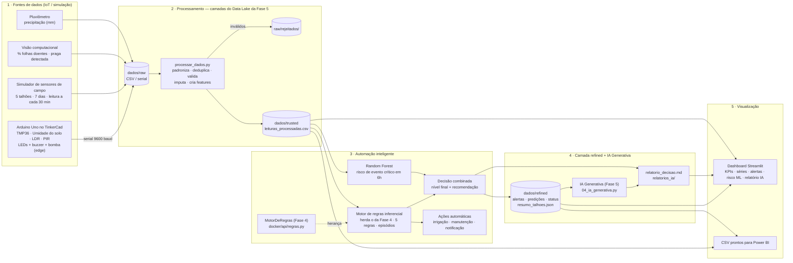

# Arquitetura da Solução AgroSmart — Fase 6

A Fase 6 é a continuação das Fases 4 e 5: reaproveita o **código** delas (o motor de regras da
Fase 4 e o módulo de IA Generativa da Fase 5) e as **camadas do Data Lake** da Fase 5
(raw → trusted → refined) em uma plataforma única que **coleta → processa → analisa/decide →
apresenta**. A imagem exportada do diagrama está em
[`../docs/arquitetura.png`](../docs/arquitetura.png).

## Diagrama

## Componentes

| # | Componente | Arquivo | Responsabilidade |
|---|---|---|---|
| 1 | **Estação TinkerCad** | `iot/agrosmart_tinkercad.ino` | Arduino Uno com 4 sensores (temperatura TMP36, umidade do solo, luminosidade por fotorresistor e movimento por PIR). Faz **automação de borda (edge)**: liga a bomba de irrigação (LED azul) com histerese 30%→45%, acende LED verde/amarelo/vermelho conforme o status e dispara o buzzer em situação crítica. Envia uma linha CSV pela serial a cada 2 s. |
| 2 | **Simulador de sensores de campo** | `iot/simulador_sensores.py` | Gera em escala o mesmo tipo de dado do Arduino (mais câmera e pluviômetro) para 5 talhões durante 7 dias, cada talhão com um cenário (normal, seca com irrigação quebrada, onda de calor, infestação de lagarta, geada). Injeta falhas reais de campo: duplicatas, campos vazios, valores impossíveis e mensagens fora de ordem. Substitui o producer Kafka da Fase 4 para fins de demonstração. |
| 3 | **Camada Raw** | `dados/raw/` | Dados exatamente como chegaram (`sensores_campo.csv` e `tinkercad_serial.txt`) e, como na Fase 5, `raw/rejeitados/` com as leituras barradas na validação e o motivo. |
| 4 | **Processamento** | `processamento/processar_dados.py` | Unifica as duas fontes em um schema único, converte tipos, remove duplicatas, rejeita leituras fisicamente impossíveis (guardando o motivo), interpola campos vazios e cria as features usadas pela automação: médias móveis de 3h, tendência de umidade em 6h, chuva acumulada em 24h, máxima/mínima de 24h e período do dia. Gera também o resumo diário por talhão. |
| 5 | **Camada Trusted** | `dados/trusted/` | `leituras_processadas.csv` (grão de leitura, limpo e com features) e `qualidade_dados.json`. Mesmo papel da camada Trusted da Fase 5. |
| 6 | **Motor de regras** | `automacao/automacao_inteligente.py` (parte A) | Classe `MotorDeRegrasInferencial`, que **herda o `MotorDeRegras` da Fase 4** (`docker/api/regras.py`, o mesmo usado pela API Flask). As condições e os limiares das 3 regras booleanas da Fase 4 (infestação, irrigação, temperatura) viram a base de 5 regras com 3 níveis (AVISO/ATENÇÃO/CRÍTICO): déficit hídrico, falha de irrigação, temperatura extrema, infestação e movimento noturno. Agrupa leituras consecutivas em **episódios** (um alerta por problema, não um a cada leitura), executa a ação automática e registra a recomendação. |
| 7 | **Modelo de ML** | `automacao/automacao_inteligente.py` (parte B) | Random Forest que, com base nas condições atuais, prevê a probabilidade de um **evento crítico nas próximas 6h**. Validação temporal (treina nos 5 primeiros dias e testa nos 2 últimos) e comparação com um baseline reativo. Converte a probabilidade em risco BAIXO/MÉDIO/ALTO. |
| 8 | **Decisão combinada** | idem | Para cada talhão, o nível final é o mais grave entre o alerta ativo e o risco previsto, com recomendações priorizadas. Saídas na camada refined: `status_talhoes.json`, `relatorio_decisao.md`, `alertas.csv`, `acoes_automaticas.log`, `predicoes_risco.csv`, `metricas_modelo.json`. |
| 8.1 | **Camada Refined** | `dados/refined/` | Dados prontos para consumo: `resumo_diario.csv` e as saídas da automação, além do `resumo_talhoes.json` no **mesmo contrato de dados da camada Refined da Fase 5**. |
| 8.2 | **IA Generativa** | `automacao/apoio_decisao_ia.py` | Monta o `resumo_talhoes.json` (usando o `calcular_tendencia` da Fase 5) com dois campos a mais, `alertas_automacao` e `risco_previsto_6h`, e chama o **módulo de IA Generativa da Fase 5** (`datalake-demo/scripts/04_ia_generativa.py`) para gerar um relatório por talhão em `relatorios_ia/`. Funciona em modo simulado ou com a API da Anthropic (`--real`). |
| 9 | **Dashboard analítico** | `dashboard/app.py` | Painel web (Streamlit + Plotly) com filtros de talhão e período, KPIs, cards de situação atual (com o relatório da IA Generativa), evolução temporal, alertas e ações, risco previsto e métricas do modelo, estação TinkerCad e qualidade dos dados. Possui botão para rodar o pipeline novamente com outra semente. |
| 10 | **Orquestrador** | `run_plataforma.py` | Executa coleta → processamento → automação → IA Generativa em sequência e, opcionalmente, abre o dashboard. |

## Como a Fase 6 integra as fases anteriores

| Fase anterior | O que foi reaproveitado na Fase 6 |
|---|---|
| Fase 4 — pipeline de streaming e regras | **Código:** o motor de regras da Fase 6 herda a classe `MotorDeRegras` de `docker/api/regras.py` e usa as mesmas condições (`mascara_infestacao`, `mascara_irrigacao`, `mascara_temperatura`) e limiares (`LIMIAR_*`). Mudou um limiar ali, mudou nas duas fases. O simulador cumpre o papel do producer Kafka. |
| Fase 5 — Data Lake e IA Generativa | **Camadas:** `dados/raw` (+ `raw/rejeitados/`) → `dados/trusted` → `dados/refined`, igual ao `datalake-demo/`. **Contrato de dados:** `refined/resumo_talhoes.json` no formato da Fase 5. **Código:** `calcular_tendencia` (`03_camada_refined.py`) e o gerador de relatórios (`04_ia_generativa.py`), inclusive o modo `--real` com a API da Anthropic. |
| Fase 6 — novo | Sensores físicos simulados no TinkerCad com automação de borda, features temporais, modelo preditivo de ML, decisão combinada e dashboard analítico. |

## Fluxo de dados resumido

1. **Coleta:** Arduino (TinkerCad) e simulador produzem leituras → `dados/raw/`.
2. **Processamento:** `processar_dados.py` limpa, valida, imputa e enriquece → `dados/trusted/` (inválidos em `dados/raw/rejeitados/`, resumo diário em `dados/refined/`).
3. **Automação:** regras (base da Fase 4) geram episódios de alerta e ações; o modelo prevê o risco em 6h; a decisão combina os dois → `dados/refined/`.
4. **IA Generativa:** o contrato `resumo_talhoes.json` alimenta o módulo da Fase 5, que gera um relatório por talhão → `dados/refined/relatorios_ia/`.
5. **Visualização:** o dashboard lê `trusted/` e `refined/` e mostra os indicadores, a evolução, os alertas, as recomendações e os relatórios da IA.
