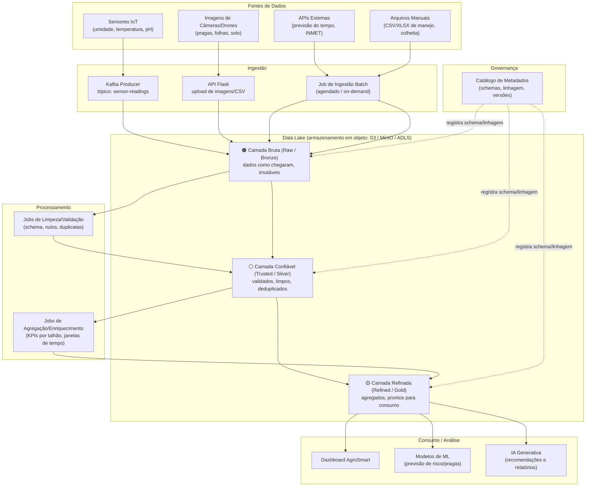

# Arquitetura de Data Lake — AgroSmart (Fase 5)

## Visão Geral

A Fase 5 evolui o pipeline de streaming da Fase 4 (Kafka → Motor de Regras → API/Dashboard)
para uma arquitetura de **Data Lake em camadas**, capaz de reter o histórico bruto dos dados de
campo, garantir confiabilidade/qualidade e disponibilizar dados prontos para BI, Machine Learning
e a IA Generativa de apoio à decisão.

## Diagrama da Arquitetura

## Função de Cada Camada

**Camada Bruta (Raw / Bronze)**
Recebe os dados exatamente como chegam das fontes — leituras de sensores publicadas no Kafka,
imagens enviadas via API, respostas de APIs externas e planilhas de manejo. Nada é alterado ou
descartado aqui: a camada é imutável e particionada por fonte e data (`raw/sensores/dt=2026-09-05/`),
funcionando como "fonte da verdade" para reprocessamentos futuros, mesmo que o dado tenha erro
ou ruído.

**Camada Confiável (Trusted / Silver)**
Recebe o resultado de jobs de limpeza: validação de schema, remoção de duplicatas, tratamento de
nulos/outliers (ex.: leitura de umidade fora da faixa 0–100%), padronização de unidades e junção de
metadados (qual sensor, qual talhão). Os dados aqui já podem ser confiavelmente consultados, mas
ainda estão no grão original (uma leitura por linha).

**Camada Refinada (Refined / Gold)**
Contém dados agregados e modelados para consumo direto: médias por talhão/hora, contagem de
alertas por severidade, séries históricas prontas para gráficos, e as tabelas que alimentam o
dashboard, os modelos de ML e o módulo de IA Generativa. É a camada otimizada para performance de
leitura (ex.: Parquet particionado), não para escrita.

**Governança/Catálogo**
Transversal às três camadas, registra o schema de cada dataset, a linhagem (de onde veio, quais
jobs geraram), versionamento e regras de qualidade — essencial para auditar decisões tomadas com
apoio da IA Generativa.
