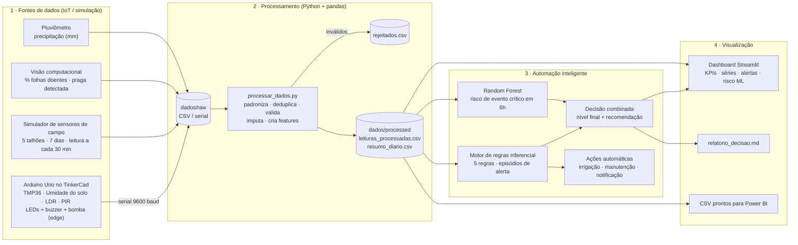

# Arquitetura da Solução AgroSmart — Fase 6

A Fase 6 consolida os componentes das fases anteriores em uma plataforma única que **coleta →
processa → analisa/decide → apresenta**. A imagem exportada do diagrama está em
[`../docs/arquitetura.png`](../docs/arquitetura.png).

## Diagrama

## Componentes

| # | Componente | Arquivo | Responsabilidade |
|---|---|---|---|
| 1 | **Estação TinkerCad** | `iot/agrosmart_tinkercad.ino` | Arduino Uno com 4 sensores (temperatura TMP36, umidade do solo, luminosidade por fotorresistor e movimento por PIR). Faz **automação de borda (edge)**: liga a bomba de irrigação (LED azul) com histerese 30%→45%, acende LED verde/amarelo/vermelho conforme o status e dispara o buzzer em situação crítica. Envia uma linha CSV pela serial a cada 2 s. |
| 2 | **Simulador de sensores de campo** | `iot/simulador_sensores.py` | Gera em escala o mesmo tipo de dado do Arduino (mais câmera e pluviômetro) para 5 talhões durante 7 dias, cada talhão com um cenário (normal, seca com irrigação quebrada, onda de calor, infestação de lagarta, geada). Injeta falhas reais de campo: duplicatas, campos vazios, valores impossíveis e mensagens fora de ordem. Substitui o producer Kafka da Fase 4 para fins de demonstração. |
| 3 | **Camada Raw** | `dados/raw/` | Dados exatamente como chegaram (`sensores_campo.csv` e `tinkercad_serial.txt`). Mesmo conceito da camada Raw do Data Lake da Fase 5. |
| 4 | **Processamento** | `processamento/processar_dados.py` | Unifica as duas fontes em um schema único, converte tipos, remove duplicatas, rejeita leituras fisicamente impossíveis (guardando o motivo), interpola campos vazios e cria as features usadas pela automação: médias móveis de 3h, tendência de umidade em 6h, chuva acumulada em 24h, máxima/mínima de 24h e período do dia. Gera também o resumo diário por talhão. |
| 5 | **Camada Processed** | `dados/processed/` | `leituras_processadas.csv` (grão de leitura), `resumo_diario.csv` (agregado), `rejeitados.csv` e `qualidade_dados.json`. Equivale à camada Trusted/Refined da Fase 5. |
| 6 | **Motor de regras** | `automacao/automacao_inteligente.py` (parte A) | Evolução das 3 regras booleanas da Fase 4 para 5 regras com 3 níveis (AVISO/ATENÇÃO/CRÍTICO): déficit hídrico, falha de irrigação, temperatura extrema, infestação e movimento noturno. Agrupa leituras consecutivas em **episódios** (um alerta por problema, não um a cada leitura), executa a ação automática e registra a recomendação. |
| 7 | **Modelo de ML** | `automacao/automacao_inteligente.py` (parte B) | Random Forest que, com base nas condições atuais, prevê a probabilidade de um **evento crítico nas próximas 6h**. Validação temporal (treina nos 5 primeiros dias e testa nos 2 últimos) e comparação com um baseline reativo. Converte a probabilidade em risco BAIXO/MÉDIO/ALTO. |
| 8 | **Decisão combinada** | idem | Para cada talhão, o nível final é o mais grave entre o alerta ativo e o risco previsto, com recomendações priorizadas. Saídas: `status_talhoes.json`, `relatorio_decisao.md`, `alertas.csv`, `acoes_automaticas.log`, `predicoes_risco.csv`, `metricas_modelo.json`. |
| 9 | **Dashboard analítico** | `dashboard/app.py` | Painel web (Streamlit + Plotly) com filtros de talhão e período, KPIs, cards de situação atual, evolução temporal, alertas e ações, risco previsto e métricas do modelo, estação TinkerCad e qualidade dos dados. Possui botão para rodar o pipeline novamente com outra semente. |
| 10 | **Orquestrador** | `run_fase6.py` | Executa coleta → processamento → automação em sequência e, opcionalmente, abre o dashboard. |

## Como a Fase 6 integra as fases anteriores

| Fase anterior | O que foi reaproveitado na Fase 6 |
|---|---|
| Fase 4 — pipeline de streaming e regras | As 3 regras booleanas (infestação, irrigação, temperatura) e os níveis CRÍTICO/ATENÇÃO/AVISO viraram a base do motor de regras; o simulador cumpre o papel do producer Kafka. |
| Fase 5 — Data Lake e IA Generativa | Organização em camadas (raw → processed → output), rejeição auditável de dados inválidos e o relatório de apoio à decisão por talhão (`relatorio_decisao.md`) no mesmo formato. |
| Fase 6 — novo | Sensores físicos simulados no TinkerCad com automação de borda, features temporais, modelo preditivo de ML, decisão combinada e dashboard analítico. |

## Fluxo de dados resumido

1. **Coleta:** Arduino (TinkerCad) e simulador produzem leituras → `dados/raw/`.
2. **Processamento:** `processar_dados.py` limpa, valida, imputa e enriquece → `dados/processed/`.
3. **Automação:** regras geram episódios de alerta e ações; o modelo prevê o risco em 6h; a decisão combina os dois → `dados/output/`.
4. **Visualização:** o dashboard lê `processed/` e `output/` e mostra os indicadores, a evolução, os alertas e as recomendações.
