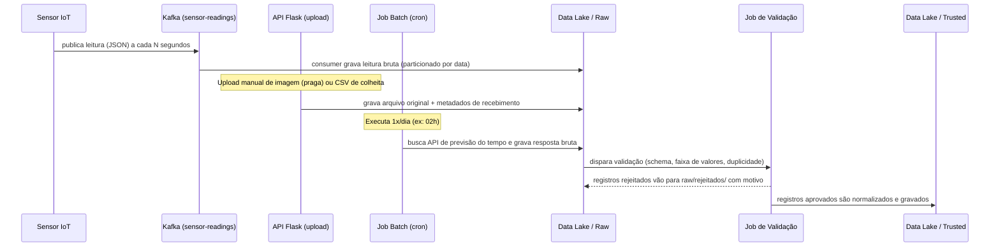

# Ingestão, Administração e Manutenção de Dados — AgroSmart

## Fluxo de Ingestão

## Exemplo de Dados Ingeridos

Três exemplos representativos foram incluídos em `ingestion/samples/`:

- `leitura_sensor.json` — leitura pontual de um sensor IoT publicada no Kafka
- `leituras_solo.csv` — lote diário de leituras de solo enviado por um talhão
- `deteccao_imagem.json` — metadados de uma imagem de câmera/drone processada por visão computacional (a imagem em si fica no armazenamento de objetos; este JSON é o registro estruturado que aponta para ela)

## Organização dos Dados

- **Particionamento**: todos os datasets são particionados por `fonte/ano/mes/dia` (e, quando fizer
  sentido, por `talhao_id`), o que acelera consultas por período e simplifica a expiração de dados antigos.
- **Formato**: a camada Raw mantém o formato original (JSON/CSV/imagem); as camadas Trusted e
  Refined usam Parquet, mais compacto e eficiente para leitura analítica.
- **Nomenclatura**: `<fonte>_<talhao>_<timestamp>.<ext>` para rastreabilidade sem depender só de metadados externos.
- **Catálogo de metadados**: cada dataset tem um schema versionado (ex.: via um registro simples
  em `catalogo/schemas/*.json` neste projeto, ou uma ferramenta como Hive Metastore/AWS Glue em produção),
  documentando colunas, tipos e a origem de cada campo.

## Estratégia de Manutenção e Confiabilidade

1. **Validação na entrada**: todo dado que sai da camada Raw para a Trusted passa por checagem de
   schema, faixas plausíveis (ex.: umidade entre 0–100%, temperatura entre -10°C e 55°C) e
   deduplicação por chave (`sensor_id + timestamp`). Registros reprovados não são descartados —
   vão para uma área de quarentena (`raw/rejeitados/`) com o motivo da rejeição, para auditoria.
2. **Monitoramento de qualidade**: métricas simples de qualidade (% de leituras válidas por dia,
   sensores sem enviar dados há mais de X minutos) alimentam um alerta operacional, reaproveitando
   o mesmo motor de regras já existente no pipeline Kafka da Fase 4.
3. **Retenção e ciclo de vida**: a camada Raw retém dados brutos por um período longo (ex.: 2 anos)
   para reprocessamento; dados de sensores com mais de 90 dias na Trusted são compactados/agregados
   e movidos para a Refined, reduzindo custo de armazenamento sem perder o histórico relevante.
4. **Backup e versionamento**: os datasets Trusted/Refined são gravados de forma imutável e
   versionada (novas execuções geram novas partições, nunca sobrescrevem), permitindo reverter a um
   estado anterior caso um job de processamento introduza um erro.
5. **Controle de acesso**: cada camada tem permissões distintas — apenas os jobs de ingestão
   escrevem na Raw; apenas jobs de ETL escrevem na Trusted/Refined; dashboards, ML e a IA
   Generativa têm acesso somente leitura à Refined.
